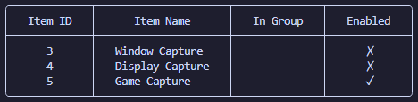
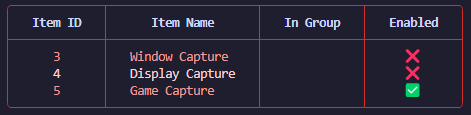
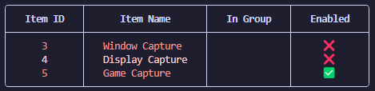

# gobs-cli

A command line interface for OBS Websocket v5

For an outline of past/future changes refer to: [CHANGELOG](CHANGELOG.md)

-----

## Table of Contents

- [Installation](#installation)
- [Configuration](#configuration)
- [Style](#style)
- [Commands](#commands)
- [License](#license)

## Installation

```console
go install github.com/onyx-and-iris/gobs-cli@latest
```

## Configuration

#### Flags

-   --host/-H: Websocket host
-   --port/-P Websocket port
-   --password/-p: Websocket password
-   --timeout/-T: Websocket timeout
-   --version/-v: Print the gobs-cli version

Pass `--host`, `--port` and `--password` as flags on the root command, for example:

```console
gobs-cli --host localhost --port 4455 --password 'websocket password' --help
```

#### Environment Variables

Store and load environment variables from:

-   A `.env` file in the cwd
-   $XDG_CONFIG_HOME / gobs-cli / config.env (see [os.UserConfigDir][userconfigdir])

```env
OBS_HOST=localhost
OBS_PORT=4455
OBS_PASSWORD=<websocket password>
OBS_TIMEOUT=5
```

## Style

Styling is opt-in, by default you will get a colourless output:



You may enable styling with the --style/-s flag:

```console
gobs-cli --style="red" sceneitem list
```

Available styles: _red, magenta, purple, blue, cyan, green, yellow, orange, white, grey, navy, black_



Optionally you may disable border colouring with the --no-border flag:



```console
gobs-cli --style="red" --no-border sceneitem list
```

Or with environment variables:

```env
GOBS_STYLE=red
GOBS_STYLE_NO_BORDER=true
```

## Commands

### ObsVersionCmd

-   Print OBS client and websocket version.

```console
gobs-cli obs-version
```

### SceneCmd

-   list: List all scenes.
    -   flags:

        *optional*
        -   --UUID: Display UUIDs of scenes.

```console
gobs-cli scene list
```

-   current: Get the current scene.
    -   flags:

        *optional*
        -   --preview:  Preview scene.

```console
gobs-cli scene current

gobs-cli scene current --preview
```

-   switch: Switch to a scene.
    -   flags:

        *optional*
        -   --preview:  Preview scene.
    -   args: SceneName

```console
gobs-cli scene switch LIVE

gobs-cli scene switch --preview LIVE
```

### SceneItemCmd

-   list: List all scene items.
    -   flags:

        *optional*
        -   --UUID: Display UUIDs of scene items.

    *optional*
    -   args: SceneName
        -   defaults to current scene

```console
gobs-cli sceneitem list

gobs-cli sceneitem list LIVE
```

-   show: Show scene item.
    -   flags:

        *optional*
        -   --group: Parent group name.
    -   args: SceneName ItemName

```console
gobs-cli sceneitem show START "Colour Source"
```

-   hide: Hide scene item.
    -   flags:

        *optional*
        -   --group: Parent group name.
    -   args: SceneName ItemName

```console
gobs-cli sceneitem hide START "Colour Source"
```

-   toggle: Toggle scene item.
    -   flags:

        *optional*
        -   --group: Parent group name.
    -   args: SceneName ItemName

```console
gobs-cli sceneitem toggle --group=test_group START "Colour Source 3"
```

-   visible: Get scene item visibility.
    -   flags:

        *optional*
        -   --group: Parent group name.
    -   args: SceneName ItemName

```console
gobs-cli sceneitem visible --group=test_group START "Colour Source 4"
```

-   transform: Transform scene item.
    -   flags:
        
        *optional*
        -   --group: Parent group name.

        -   --alignment: Alignment of the scene item.
        -   --bounds-alignment: Bounds alignment of the scene item.
        -   --bounds-height: Bounds height of the scene item.
        -   --bounds-type: Bounds type of the scene item.
        -   --bounds-width: Bounds width of the scene item.
        -   --crop-to-bounds: Whether to crop the scene item to bounds.
        -   --crop-bottom: Crop bottom value of the scene item.
        -   --crop-left: Crop left value of the scene item.
        -   --crop-right: Crop right value of the scene item.
        -   --crop-top: Crop top value of the scene item.
        -   --position-x: X position of the scene item.
        -   --position-y: Y position of the scene item.
        -   --rotation: Rotation of the scene item.
        -   --scale-x: X scale of the scene item.
        -   --scale-y: Y scale of the scene item.
    -   args: SceneName ItemName

```console
gobs-cli sceneitem transform \
    --rotation=5 \
    --position-x=250.8 \
    Scene "Colour Source 3"
```

### GroupCmd

-   list: List all groups.

    *optional*
    -   args: SceneName
        -   defaults to current scene

```console
gobs-cli group list

gobs-cli group list START
```

-   show: Show group details.
    -   args: SceneName GroupName

```console
gobs-cli group show START "test_group"
```

-   hide: Hide group.
    -   args: SceneName GroupName

```console
gobs-cli group hide START "test_group"
```

-   toggle: Toggle group.
    -   args: SceneName GroupName

```console
gobs-cli group toggle START "test_group"
```

-   status: Get group status.
    -   args: SceneName GroupName

```console
gobs-cli group status START "test_group"
```

### InputCmd

-   create: Create input.
    -   args: Name Kind

```console
gobs-cli input create 'stream mix' 'wasapi_input_capture'
```

-   remove: Remove input.
    -   args: Name

```console
gobs-cli input remove 'stream mix'
```

-   list: List all inputs.
    -   flags:

        *optional*
        -   --input: List all inputs.
        -   --output: List all outputs.
        -   --colour: List all colour sources.
        -   --ffmpeg: List all ffmpeg sources.
        -   --vlc: List all VLC sources.
        -   --uuid: Display UUIDs of inputs.

```console
gobs-cli input list

gobs-cli input list --input --colour
```

-   list-kinds: List input kinds.

```console
gobs-cli input list-kinds
```

-   mute: Mute input.
    -   args: InputName

```console
gobs-cli input mute "Mic/Aux"
```

-   unmute: Unmute input.
    -   args: InputName

```console
gobs-cli input unmute "Mic/Aux"
```

-   toggle: Toggle input.
    -   args: InputName

```console
gobs-cli input toggle "Mic/Aux"
```

-   volume: Set input volume.
    -   args: InputName Volume

```console
gobs-cli input volume -- 'Mic/Aux' -30.6
```

-   show: Show input details.
    -   args: Name
    -   flags:

        *optional*
        -   --verbose: List all available input devices.

-   update: Update input settings.
    -   args: InputName DeviceName

```console
gobs-cli input update 'Mic/Aux' 'Voicemeeter Out B1 (VB-Audio Voicemeeter VAIO)'
```

-   kind-defaults: Get default settings for an input kind.
    -   args: Kind

```console
gobs-cli input kind-defaults 'wasapi_input_capture'
```

### TextCmd

-   current: Display current text for a text input.
    -   args: InputName

```console
gobs-cli text current "My Text Input"
```

-   update: Update the text of a text input.
    -   args: InputName NewText

```console
gobs-cli text update "My Text Input" "hi OBS!"
```

### RecordCmd

-   start: Start recording.

```console
gobs-cli record start
```

-   stop: Stop recording.

```console
gobs-cli record stop
```

-   status: Get recording status.

```console
gobs-cli record status
```

-   toggle: Toggle recording.

```console
gobs-cli record toggle
```

-   pause: Pause recording.

```console
gobs-cli record pause
```

-   resume: Resume recording.

```console
gobs-cli record resume
```

-   directory: Get/Set recording directory.

    *optional*
    -   args: RecordDirectory
        -   if not passed the current record directory will be printed.

```console
gobs-cli record directory

gobs-cli record directory "/home/me/obs-vids/"
gobs-cli record directory "C:/Users/me/Videos"
```

-   split: Split recording.

```console
gobs-cli record split
```

-   chapter: Create a chapter in the recording.

    *optional*
    -   arg: ChapterName

```console
gobs-cli record chapter "Chapter Name"
```

### StreamCmd

-   start: Start streaming.

```console
gobs-cli stream start
```

-   stop: Stop streaming.

```console
gobs-cli stream stop
```

-   status: Get streaming status.

```console
gobs-cli stream status
```

-   toggle: Toggle streaming.

```console
gobs-cli stream toggle
```

### SceneCollectionCmd

-   list: List scene collections.

```console
gobs-cli scenecollection list
```

-   current: Get current scene collection.

```console
gobs-cli scenecollection current
```

-   switch: Switch scene collection.
    -   args: Name

```console
gobs-cli scenecollection switch test-collection
```

-   create: Create scene collection.
    -   args: Name

```console
gobs-cli scenecollection create test-collection
```

### ProfileCmd

-   list: List profiles.

```console
gobs-cli profile list
```

-   current: Get current profile.

```console
gobs-cli profile current
```

-   switch: Switch profile.
    -   args: Name

```console
gobs-cli profile switch test-profile
```

-   create: Create profile.
    -   args: Name

```console
gobs-cli profile create test-profile
```

-   remove: Remove profile.
    -   args: Name

```console
gobs-cli profile remove test-profile
```

### ReplayBufferCmd

-   start: Start replay buffer.

```console
gobs-cli replaybuffer start
```

-   stop: Stop replay buffer.

```console
gobs-cli replaybuffer stop
```

-   toggle: Toggle replay buffer.

```console
gobs-cli replaybuffer toggle
```

-   status: Get replay buffer status.

```console
gobs-cli replaybuffer status
```

-   save: Save replay buffer.

```console
gobs-cli replaybuffer save
```

### StudioModeCmd

-   enable: Enable studio mode.

```console
gobs-cli studiomode enable
```

-   disable: Disable studio mode.

```console
gobs-cli studiomode disable
```

-   toggle: Toggle studio mode.

```console
gobs-cli studiomode toggle
```

-   status: Get studio mode status.

```console
gobs-cli studiomode status
```

### VirtualCamCmd

-   start: Start virtual camera.

```console
gobs-cli virtualcam start
```

-   stop: Stop virtual camera.

```console
gobs-cli virtualcam stop
```

-   toggle: Toggle virtual camera.

```console
gobs-cli virtualcam toggle
```

-   status: Get virtual camera status.

```console
gobs-cli virtualcam status
```

### HotkeyCmd

-   list: List all hotkeys.

```console
gobs-cli hotkey list
```

-   trigger: Trigger a hotkey by name.

```console
gobs-cli hotkey trigger OBSBasic.StartStreaming

gobs-cli hotkey trigger OBSBasic.StopStreaming
```

-   trigger-sequence: Trigger a hotkey by sequence.
    -   flags:

        *optional*
        -   --shift: Press shift.
        -   --ctrl: Press control.
        -   --alt: Press alt.
        -   --cmd: Press command (mac).

    -   args: keyID
        -   Check [obs-hotkeys.h][obs-keyids] for a full list of OBS key ids.

```console
gobs-cli hotkey trigger-sequence OBS_KEY_F1 --ctrl

gobs-cli hotkey trigger-sequence OBS_KEY_F1 --shift --ctrl
```

### FilterCmd

-   list: List all filters.

    *optional*
    -   args: SourceName
        -   defaults to current scene

```console
gobs-cli filter list
```

-   enable: Enable filter.
    -   args: SourceName FilterName

```console
gobs-cli enable 'Mic/Aux' 'Gain'
```

-   disable: Disable filter.
    -   args: SourceName FilterName

```console
gobs-cli disable 'Mic/Aux' 'Gain'
```

-   toggle: Toggle filter.
    -   args: SourceName FilterName

```console
gobs-cli toggle 'Mic/Aux' 'Gain'
```

-   status: Get filter status.
    -   args: SourceName FilterName

```console
gobs-cli status 'Mic/Aux' 'Gain'
```

### ProjectorCmd

-   list-monitors: List available monitors.

```console
gobs-cli projector list-monitors
```

-   open: Open a fullscreen projector for a source on a specific monitor.
    -   flags:

        *optional*
        -   --monitor-index: Index of the monitor to open the projector on.
            -   defaults to 0

    *optional*
    -   args: SourceName
        -   defaults to current scene

```console
gobs-cli projector open

gobs-cli projector open --monitor-index=1 "test_scene"

gobs-cli projector open --monitor-index=1 "test_group"
```

### ScreenshotCmd

-   save: Take a screenshot and save it to a file.
    -   flags:

        *optional*
        -   --width:
            -   defaults to 1920
        -   --height:
            -   defaults to 1080
        -   --quality:
            -   defaults to -1

    -   args: SourceName FilePath

```console
gobs-cli screenshot save --width=2560 --height=1440 "Scene" "C:\Users\me\Videos\screenshot.png"
```

### SettingsCmd

-   show: Show settings.
    -   flags:

        *optional*
        -   --video: Show video settings.
        -   --record: Show record directory.
        -   --profile: Show profile parameters.

```console
gobs-cli settings show --video --record
```

-   profile: Get/Set profile parameter setting.
    -   args: Category Name Value

```console
gobs-cli settings profile SimpleOutput VBitrate

gobs-cli settings profile SimpleOutput VBitrate 6000
```

-   stream-service: Get/Set stream service setting.
    -   flags:
        -   --key: Stream key.
        -   --server: Stream server URL.

    *optional*
    -   args: Type

```console
gobs-cli settings stream-service

gobs-cli settings stream-service --key='live_xyzxyzxyzxyz' rtmp_common
```

-   video: Get/Set video setting.
    -   flags:

        *optional*
        -   --base-width: Base (canvas) width.
        -   --base-height: Base (canvas) height.
        -   --output-width: Output (scaled) width.
        -   --output-height: Output (scaled) height.
        -   --fps-num: Frames per second numerator.
        -   --fps-den: Frames per second denominator.

```console
gobs-cli settings video

gobs-cli settings video --base-width=1920 --base-height=1080
```


## License

`gobs-cli` is distributed under the terms of the [MIT](https://spdx.org/licenses/MIT.html) license.


[userconfigdir]: https://pkg.go.dev/os#UserConfigDir
[obs-keyids]: https://github.com/obsproject/obs-studio/blob/master/libobs/obs-hotkeys.h
[no-colour]: https://no-color.org/
